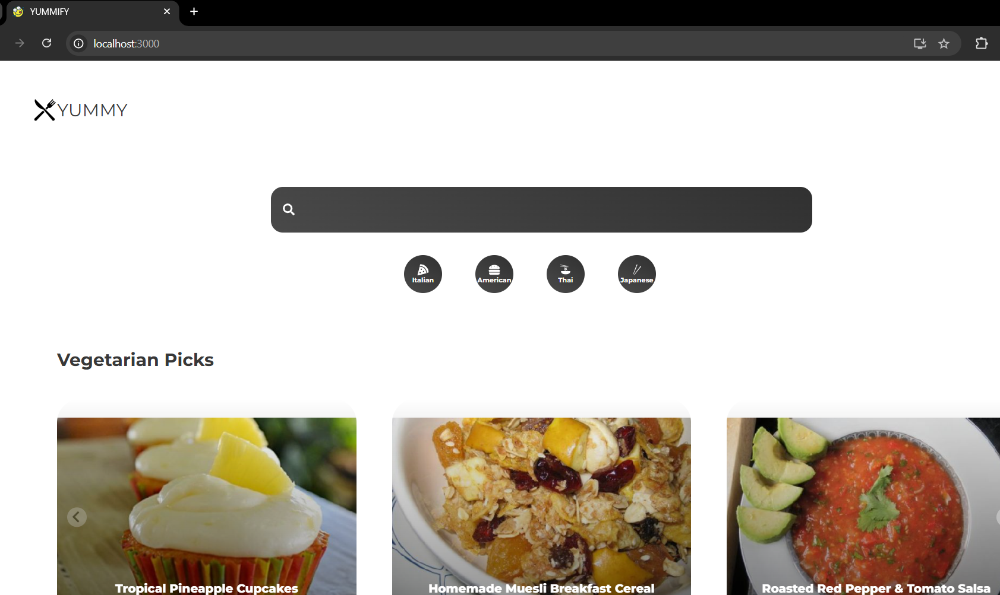
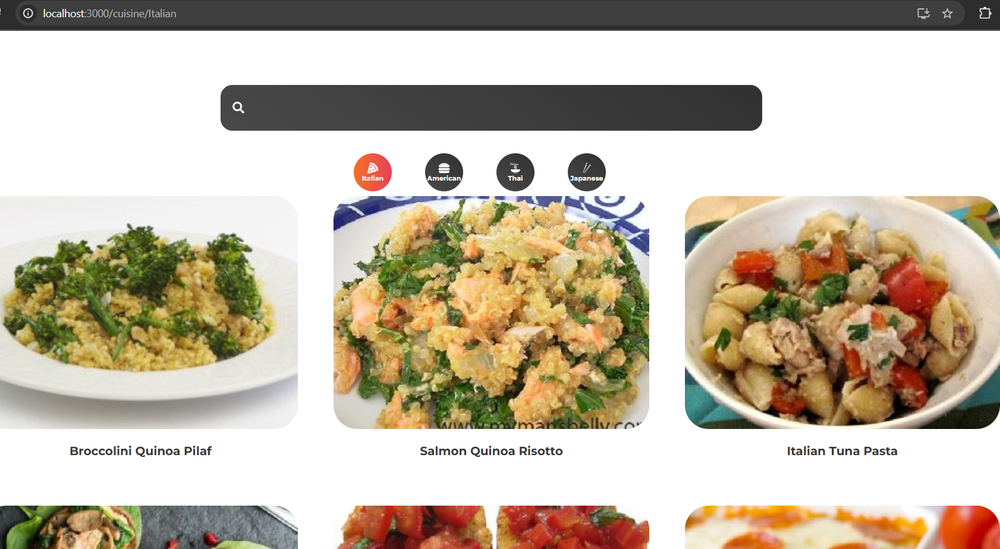
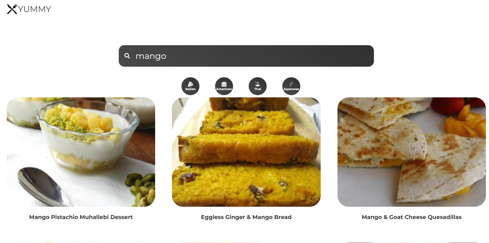
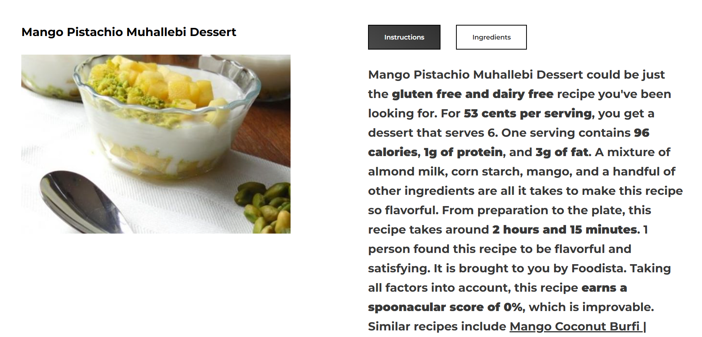
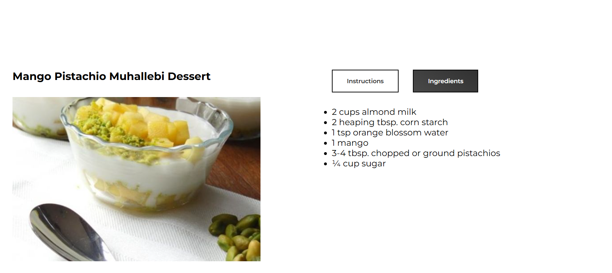

# 🍽️ Yummify

**Yummify** is a simple and visually appealing recipe app built using **React**. It fetches recipes from the [Spoonacular API](https://spoonacular.com/food-api) and presents them in a smooth and modern UI.

## 🌟 Features

- 🔍 Search and browse recipes 
- 📸 Visually rich **recipe cards** with images and titles
- 🎯 Built with **React Router** for seamless navigation
- 💅 Styled using **styled-components**


## 🧰 Tech Stack

- React.js : Frontend library for building the user interface using components.
- React Router : For handling dynamic routing between recipe categories and search results.
- Styled Components : To style React components using CSS-in-JS with scoped styling.
- React Icons : For adding intuitive and visually appealing icons.
- Spoonacular Recipe API : Used to fetch real-time recipe data including ingredients, cuisines, and instructions.


## 🚀 Getting Started

### 1. Clone the Repository

```bash
git clone https://github.com/YuRiKaPraJaPaTi/yummify.git
cd yummify
```

### 2. Install Dependencies

```bash
npm install
```

### 3. Add Your API Key

Create a `.env` file in the root and add your Spoonacular API key:

```
REACT_APP_API_KEY=your_spoonacular_api_key
```

### 4. Run the App

```bash
npm start
```

Visit `http://localhost:3000` to explore Yummify.

## 🌐 Deployment

This project can be deployed using **GitHub Pages**.

To deploy:

```bash
npm run build
npm run deploy
```

<!-- ## 📸 Preview

_Include a screenshot or a short screen recording here if possible._

## 📄 License

MIT License © 2025 [Your Name]

--- -->

**Enjoy exploring recipes with Yummify!**

## 📷 Project Screenshots

1. **Home Page**  
     
   *Figure 1: The main landing screen *

2. **Cuisine Type**  
     
   *Figure 2: Italian cuisine select*

3. **Search**  
     
   *Figure 3: Searched for mango*

4. **Recipe Instructions**  
     
   *Figure 4: Showing recipe instructions*

5. **Recipe Ingredients**  
     
   *Figure 5: Showing recipe ingredients*


# Getting Started with Create React App

This project was bootstrapped with [Create React App](https://github.com/facebook/create-react-app).

## Available Scripts

In the project directory, you can run:

### `npm start`

Runs the app in the development mode.\
Open [http://localhost:3000](http://localhost:3000) to view it in your browser.

The page will reload when you make changes.\
You may also see any lint errors in the console.

### `npm test`

Launches the test runner in the interactive watch mode.\
See the section about [running tests](https://facebook.github.io/create-react-app/docs/running-tests) for more information.

### `npm run build`

Builds the app for production to the `build` folder.\
It correctly bundles React in production mode and optimizes the build for the best performance.

The build is minified and the filenames include the hashes.\
Your app is ready to be deployed!

See the section about [deployment](https://facebook.github.io/create-react-app/docs/deployment) for more information.

### `npm run eject`

**Note: this is a one-way operation. Once you `eject`, you can't go back!**

If you aren't satisfied with the build tool and configuration choices, you can `eject` at any time. This command will remove the single build dependency from your project.

Instead, it will copy all the configuration files and the transitive dependencies (webpack, Babel, ESLint, etc) right into your project so you have full control over them. All of the commands except `eject` will still work, but they will point to the copied scripts so you can tweak them. At this point you're on your own.

You don't have to ever use `eject`. The curated feature set is suitable for small and middle deployments, and you shouldn't feel obligated to use this feature. However we understand that this tool wouldn't be useful if you couldn't customize it when you are ready for it.

## Learn More

You can learn more in the [Create React App documentation](https://facebook.github.io/create-react-app/docs/getting-started).

To learn React, check out the [React documentation](https://reactjs.org/).

### Code Splitting

This section has moved here: [https://facebook.github.io/create-react-app/docs/code-splitting](https://facebook.github.io/create-react-app/docs/code-splitting)

### Analyzing the Bundle Size

This section has moved here: [https://facebook.github.io/create-react-app/docs/analyzing-the-bundle-size](https://facebook.github.io/create-react-app/docs/analyzing-the-bundle-size)

### Making a Progressive Web App

This section has moved here: [https://facebook.github.io/create-react-app/docs/making-a-progressive-web-app](https://facebook.github.io/create-react-app/docs/making-a-progressive-web-app)

### Advanced Configuration

This section has moved here: [https://facebook.github.io/create-react-app/docs/advanced-configuration](https://facebook.github.io/create-react-app/docs/advanced-configuration)

### Deployment

This section has moved here: [https://facebook.github.io/create-react-app/docs/deployment](https://facebook.github.io/create-react-app/docs/deployment)

### `npm run build` fails to minify

This section has moved here: [https://facebook.github.io/create-react-app/docs/troubleshooting#npm-run-build-fails-to-minify](https://facebook.github.io/create-react-app/docs/troubleshooting#npm-run-build-fails-to-minify)
